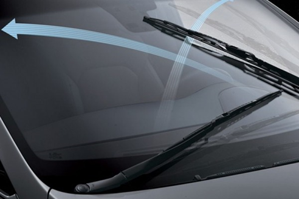
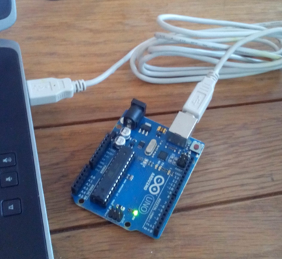
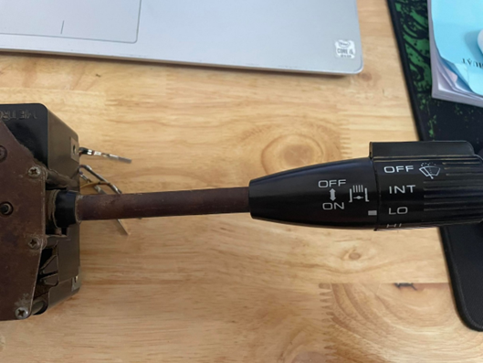
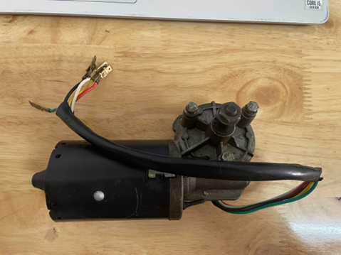
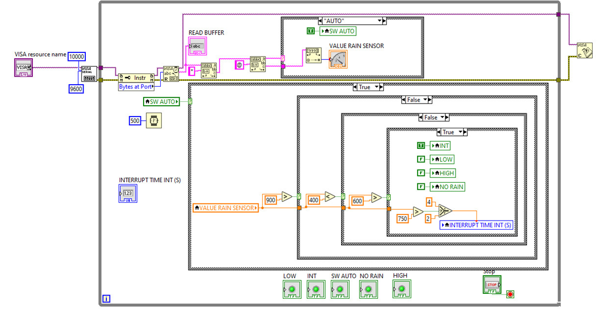
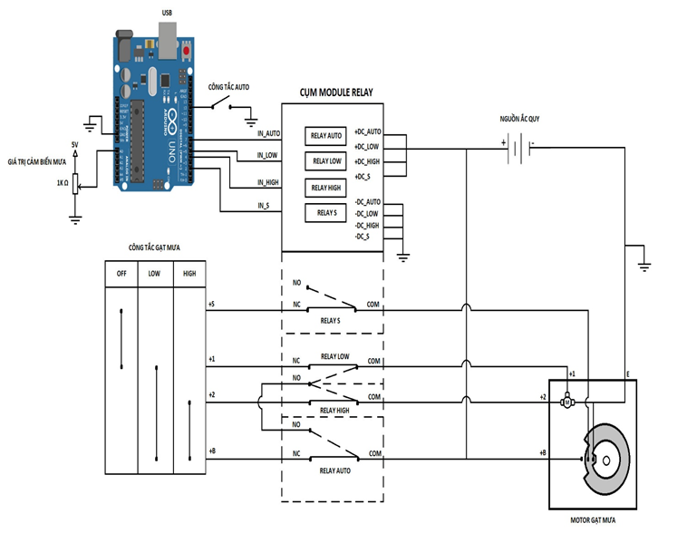
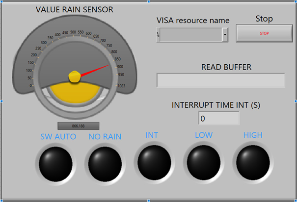
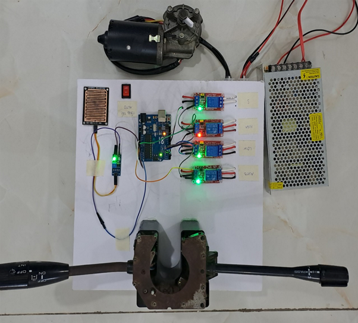

# PROJECT: HỆ THỐNG GẠT MƯA TỰ ĐỘNG

Project này liên quan đến hệ thống điều khiển gạt mưa thủ công và gạt mưa tự động. Project giúp ta có một góc nhìn cơ bản về hệ thống điều khiển điện tử trên xe cũng như trên hệ thống gạt mưa của ô tô. 

### Thông tin về source code:

- Viết bằng ngôn ngữ C++ trên ứng dụng Arduino IDE
- Code labview được thiết kế trên ứng dụng Labview 2020-64bit

### Project bao gồm các kiến thức đã sử dụng như:

- Nhập xuất dữ liệu
- Arduino điều khiển relay 5 chân bằng tín hiệu của cảm biến gạt mưa
- Arduino sử dụng external interrupt để đếm thời gian mà chế độ tự động gạt mưa hoạt động.
- Thiết kế giao diện điều khiển tự động trên ứng dụng Labview
- Thiết kế mạch điện tử điều khiển gạt mưa và điều khiển điện tử bằng Arduino
- Nắm rõ các cơ chế hoạt động của hệ thống gạt mưa trên xe.

## Cấu trúc hệ thống có:

- Nguồn tổ ong 12V-10A
- Relay 5 chân
- Arduino Uno R3

- Cụm công tắc gạt mưa

- Motor gạt mưa

- Code Arduino viết bằng C++
- Code Labview

## Cấu trúc chương trình: 

- Sơ đồ hệ thống gạt mưa tự động: 

Trong sơ đồ có thể thấy rằng, việc điều khiển tự động chỉ kích hoạt khi chế độ AUTO được bật. Khi đó, Arduino chỉ phụ thuộc vào giá trị cảm biến mưa để điều khiển hệ thống gạt mưa. Và hệ thống không còn điều khiển bởi công tắc gạt mưa nữa. Đây là sự hạn chế của project này. Mọi người có thể phát triển project này thành việc điều khiển chế độ AUTO dựa trên cụm công tắc gạt mưa. 
  - Chế độ NORMAL: công tắc AUTO chưa bật, chế độ auto không hoạt động.
  - Chế độ AUTO: công tắc AUTO bật, arduino nhận tín hiệu điều khiển module relay AUTO, ngắt tiếp điểm COM_AUTO-NC_AUTO và đóng tiếp điểm COM_AUTO-NO_AUTO.
  - Chế độ LOW(AUTO): khi có mưa, cảm biến nhận tín hiệu gửi giá trị về cho arduino xử lý. Arduino điều khiển module relay LOW ngắt tiếp điểm COM_LOW-NC_LOW và đóng tiếp điểm COM_LOW-NO_LOW, đồng thời ngắt tiếp điểm COM_S-NC_S. Khi đó, dòng điện chạy từ cực dương ->chân +B motor -> chân COM_AUTO-> chân NO_AUTO->chân NO_LOW-> chân COM_LOW-> chân +1 motor.

- Hệ thống giao diện Labview: 
Giao diện của màn hình Front Panel gồm các chê độ sau:
  - Công tắc Auto: khi chuyển sang chế độ Auto thì đèn công tắc Auto và đèn No Rain sẽ sáng hiển thị trạng thái chế độ gạt mưa tự động.
  - Đèn báo No Rain: hiển thị chế độ chưa có mưa.
  - Đèn báo INT: hiển thị chế độ định thời “thời gian nghỉ của motor “.
  - INTERRUPT TIME INT: hiển thị thời gian định thời của chế độ INT sẽ có 2 khoảng thời gian định thời là 2 giây và 4 giây.
  - Đèn báo LOW: hiển thị chế độ mưa ít, motor quay với tốc dộ chậm.
  - Đèn báo HIGH: hiện thị chế độ mưa nhiều, motor quay với tốc độ nhanh.
  - VALUE RAIN SENSOR: giá trị của cảm biến mưa từ 0 đến 1023.
  - READ BUFFER: đọc giá trị dữ liệu từ Arduino.

Trong chế độ gạt mưa tự động, nó chia thành 2 mức interrupt của motor gạt mưa: 
  - Khi cảm biến mưa cảm nhận lượng nước ít thì motor gạt mưa sẽ quay ở chế độ low, thời gian interrupt là 4 giây và hiển thị lên màn hình
  - Khi cảm biến mưa cảm nhận lượng nước nhiều thì motor gạt mưa sẽ quay ở chế độ low, thời gian interrupt là 2 giây và hiển thị lên màn hình

Sản phẩm khi hoàn thành: 

